#H1 Overview
This practical assignment involved working with practical data and asked us to to various operations on the data starting from cleaning the data including replacing , deleting and processing data using various tools including panda, data visualization using seaboardm matlib etc. It involved  probability distributions to distinguish between customers who accepted one type of coupon versus not accepting the coupons.

#H1 Highlights of differences between customer who accepted or not accepted the coupons:

Lets start with proportion of total coupons that were redeemed: 0.57 (57%)
Around 40% of drivers were travelling with children in the car
All the columns were studied for missing data. As car column had most of the data as missing it was totally dropped.
Rows were deleted were data was missing in other columns.
Finally we were left with clean data , this data was used to deciper in each category what was acceptance rate.
Some findings from the plotting of different numerical an non-numerical colums
1. Occumpation labels were coming overlapping so has to create it separately to that it can be cleanly depicted.
2.Most visits to restaurant is with less than once a month
3. Weather is mostly sunny and hence skewed towards sunny
4. Widowed are very less part of the population - So seems like widowed don't travel much.
5. Coupons are more skewed towards coffee house
6. From degree perspective more Bachelors and some college are high part of popolation

#H1 For "bar" Coupons these were the findings:
1. Answer:Propotion of Coupons accepted : 0.41
2. Two groups were created for less than or equal to 3 visits and greater than 3 visits
Answer: Acceptance rate for Bar coupons (1-3 times): 0.37
Acceptance rate for Bar coupons (more than 3 times): 0.72
3. Two growps drivers who go to a bar more than once a month and are over the age of 25 and all others
Answer:Yes, there is a difference between the two groups.
For drivers who go to a bar more than once a month and are over the age of 25 acceptance rate: 0.69 
For drivers who do not match the above criteria acceptance rate: 0.34
4. Two groups were created Drivers who go to bars more than once a month and had passengers that were not a kid and had occupations other than farming, fishing, or forestry and other
Answer:Acceptance rate for drivers who go to a bar more than once a month and are over the age of 25: 0.71
Acceptance rate for all others: 0.30
5. Again ttwo groups were created
Compare the acceptance rates between those drivers who:

- go to bars more than once a month, had passengers that were not a kid, and were not widowed *OR*
- go to bars more than once a month and are under the age of 30 *OR*
- go to cheap restaurants more than 4 times a month and income is less than 50K.
Answer:Acceptance rate for drivers who       
 go to bars more than once a month, had passengers that were not a kid, and were not widowed OR       
 go to bars more than once a month and are under the age of 30 OR       
 go to cheap restaurants more than 4 times a month and income is less than 50K : 0.5871
Acceptance rate for all others: 0.2999
6. In essense the summary is as follows
#Based on the above analysis, we can conclude that:
#1. Total bar coupon acceptance rate is 0.41
#2. The acceptance rate for bar coupons is higher for  individuals above 25 and who visit bars more than once a month.
#3. The acceptance rate is also higher for individuals with no Kids, are not widowed, and do not work in farming, fishing, or forestry.
#4. The acceptance rate is lower for individuals who visit bars less than once a month or have Kids.
#5. The acceptance rate is  lower for widowed or work in farming, fishing, or forestry.
#5. The acceptance rate is significantly lower for folks who visit bars less than once a month and have kids.

#H1 Diffent Charts Summarizing the visualization
![Coupon Distribution][images/coupon_distribution.png]
![Temperature Distribution][images/temperature_distribution.png]
![Travelling with children ][images/has_children_distribution.png]
![Occupation Distribution][images/occupation_distribution.png]
![Restauranrt20to50 Distribution][images/distribution_Restaurant20To50.png]

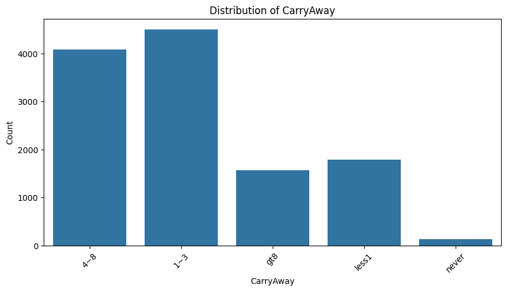
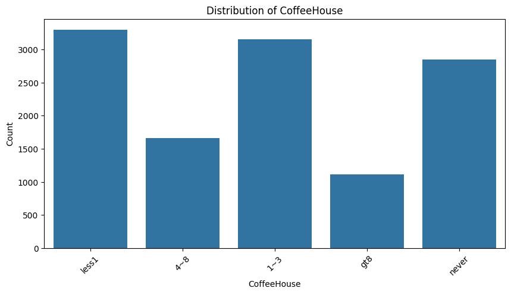
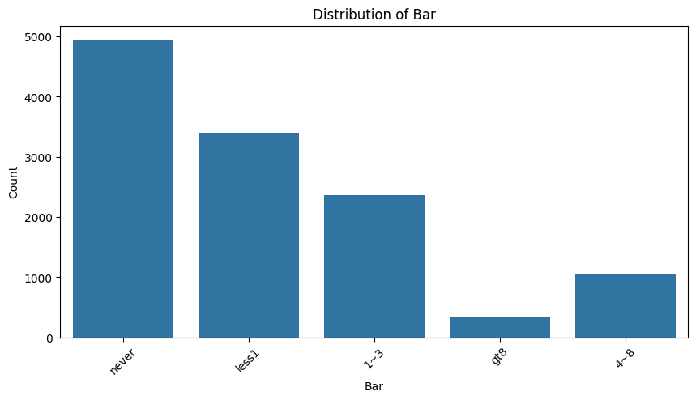
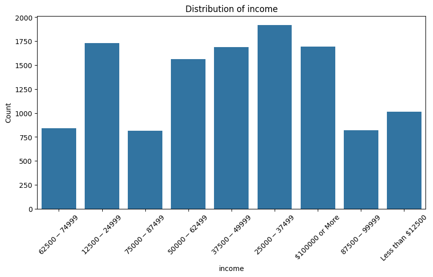
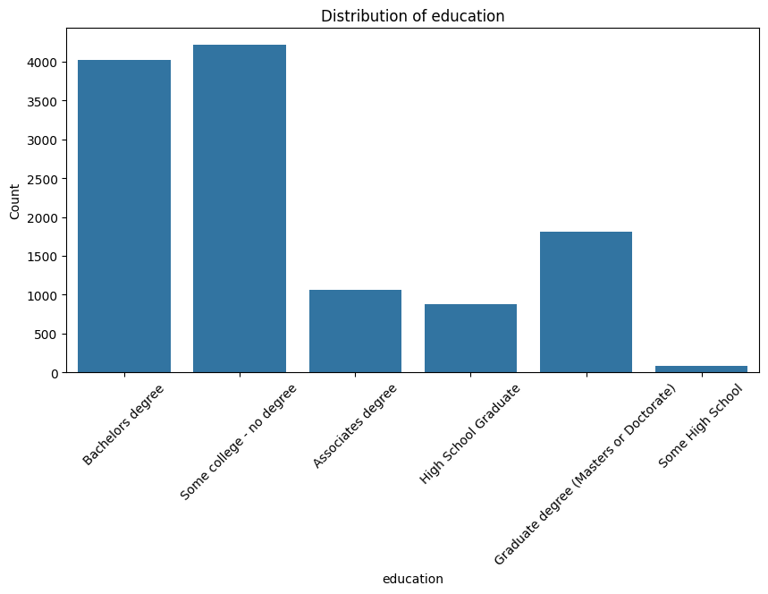
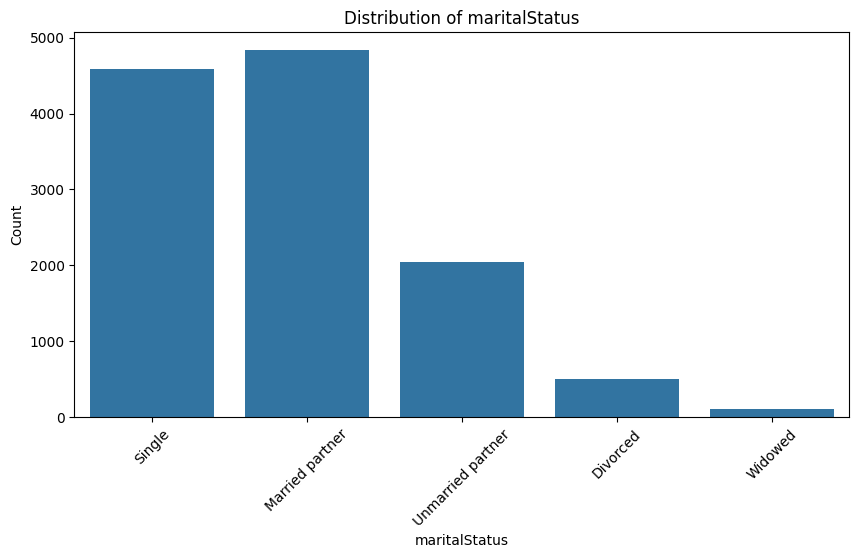
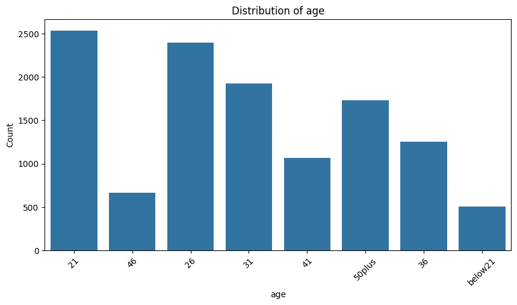
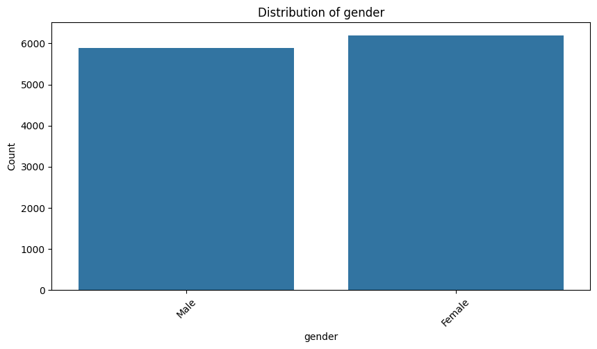
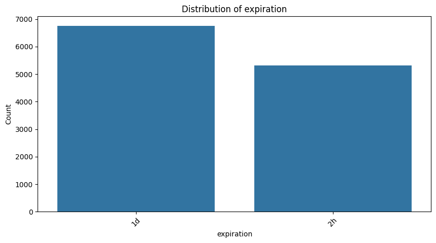 
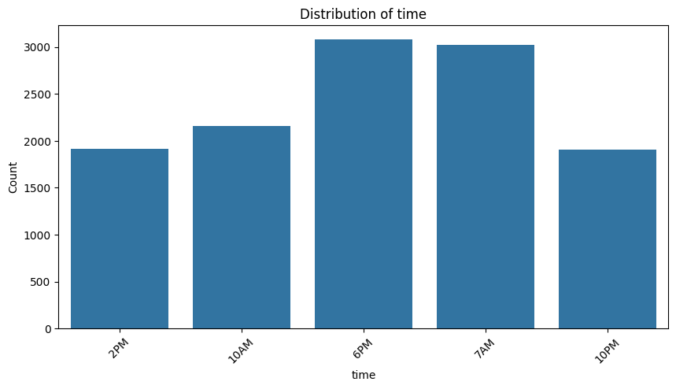 
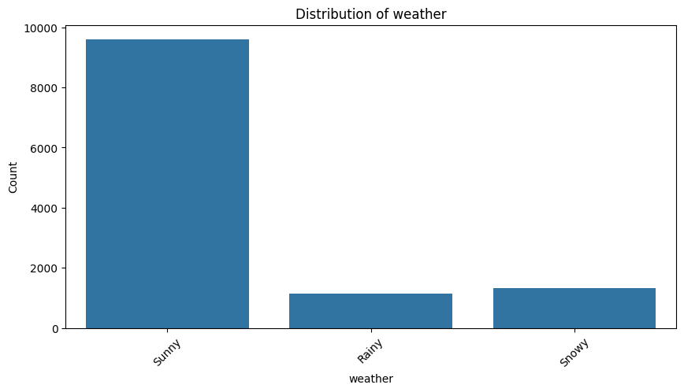 
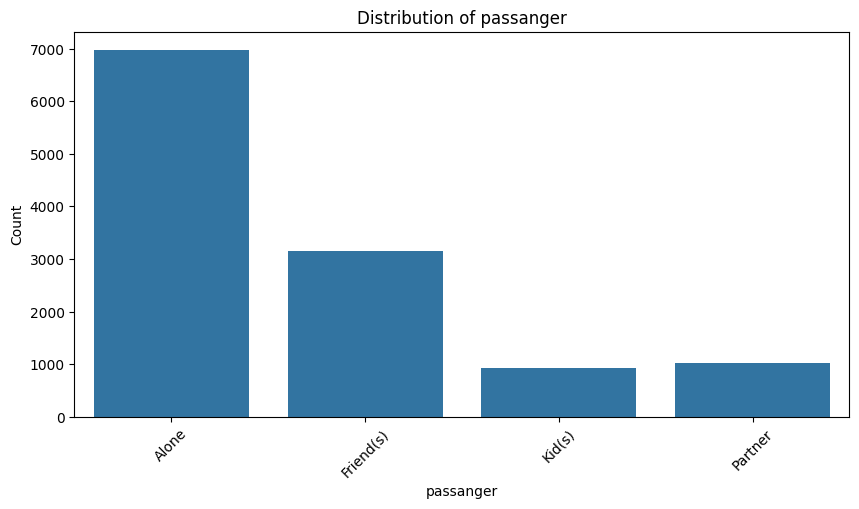 
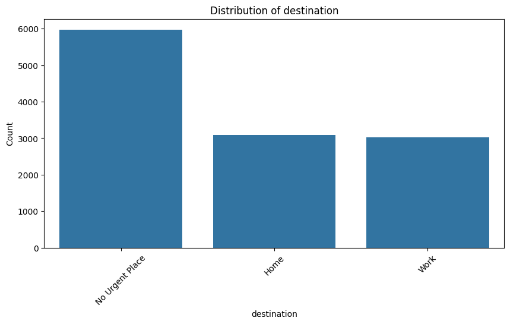 
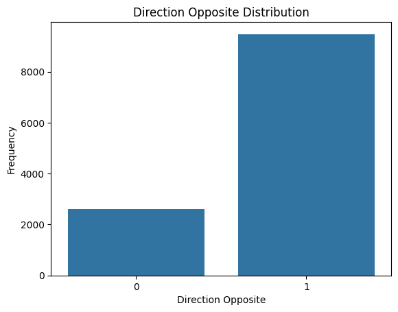 
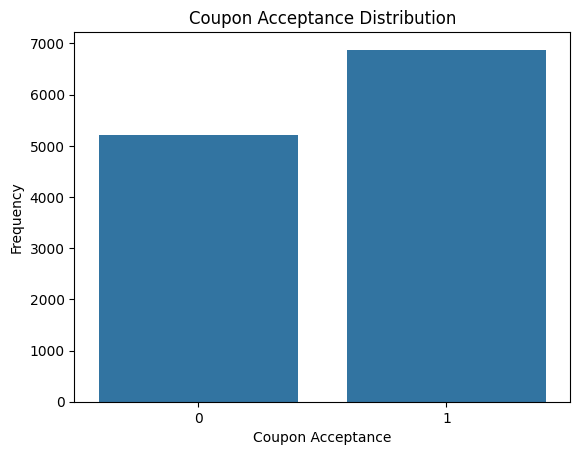 
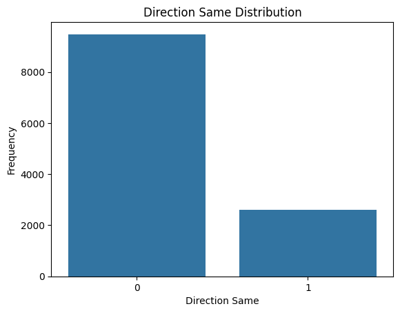 
